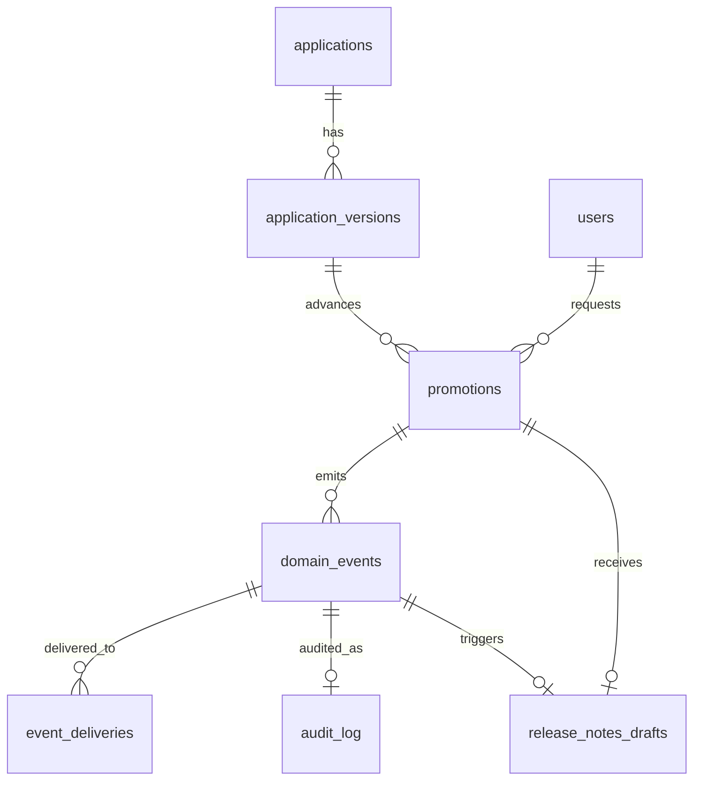

# Plan backend challenge architecture

> [$grill-with-docs](~/.agents/skills/grill-with-docs/SKILL.md) We will plan to build for this challenge: https://backend-challenge-2026.theagilemonkeys.com
>
> I want you to batch the questions where they make sense.
>
> I have already some decisions made, so we will work with those:
> - I want to follow the file structure like this project: [https://github.com/CodelyTV/csharp-ddd-skeleton/tree/master](https://github.com/CodelyTV/csharp-ddd-skeleton/tree/master), where
>   - we have under /src/ grouped by bounded context, which in my opinion there should be only one, and under that directory we have Domain, Application and Infrastructure; and under src/ a Shared directory if necessary
>   - Ports interfaces should go under Domain/
>   - Adapters should go in Infrastructure
>   - I want to have a base DomainException class from which the specific DomainExceptions will inherit
>   - under /apps/ where we will have the controllers and all entry points for each bounded context
> - I want to have a dockerfile + docker compose for the db and running the api and workers, each worker as an individual service
> - the seeds for the db should run as entrypoint for the db, no need for migrations
> - As db I want to use postgres 18
> - Since this is meant for an internal tool, I want to use as message queue the db with a table for the events
> - I want to tackle the AI **release-notes agent too**
>
> Let's discuss db structure, API structure, code architecture and Dockerfile + compose definition, plus any other things you consider important from reading the challenge

<details><summary>5 previous messages</summary>

> I’m using `grill-with-docs` exactly as requested. It composes the `grilling` and `domain-modeling` skills, so I’ll first load those instructions, inspect the challenge and the current repository, then start the interview in coherent batches while recording the resulting glossary and ADRs as decisions settle.
>
> The repository is currently empty, so there is no existing model or implementation to reconcile. I’m now extracting the challenge’s exact behavioral requirements and the reference skeleton’s conventions; I’ll treat your stated choices as fixed unless the challenge exposes a direct contradiction.
>
> <details><summary>Searched the web</summary>
>
> Searched the web for `https://backend-challenge-2026.theagilemonkeys.com`
>
> </details>
>
> The first modeling snag is already visible: the challenge says a completed Promotion is immutable, yet it also requires `RollbackPromotion`. That cannot safely be buried as an implementation detail; it determines the aggregate lifecycle, tables, endpoints, and events. I’m capturing only the terminology and the one settled infrastructure trade-off that are already unambiguous, then I’ll make this the first question batch.
>
> <details><summary>Created 2 files</summary>
>
> - Wrote `./CONTEXT.md` (+35 -0)
> - Wrote `./docs/adr/0001-postgres-as-database-and-message-queue.md` (+3 -0)
>
> </details>
</details>

I reviewed the full [challenge](https://backend-challenge-2026.theagilemonkeys.com) and the [CodelyTV reference structure](https://github.com/CodelyTV/csharp-ddd-skeleton/tree/master). The repository is otherwise empty.

I’ve started the living documentation:

- [CONTEXT.md](./CONTEXT.md)
- [ADR 0001 — PostgreSQL as database and message queue](./docs/adr/0001-postgres-as-database-and-message-queue.md)

## Batch 1: Promotion state machine

The challenge leaves several connected lifecycle decisions unresolved. My recommended model is:

```text
Requested ──approve──> Approved ──start──> Deploying ──complete──> Completed
    │                     │                    │
    └────cancel───────────┴──cancel            └──rollback──> RolledBack
```

All three ending states would be immutable.

1. **What does rollback mean?**

   Recommendation: `RollbackPromotion` is allowed only while `Deploying`, producing terminal state `RolledBack`. A completed Promotion cannot be rolled back because the challenge explicitly calls it immutable. Reverting something already completed would require a new compensating Promotion, which is outside the challenge’s core scope.

2. **When can cancellation happen?**

   Recommendation: allow cancellation from `Requested` and `Approved`, but not after deployment starts. Once deploying, rollback expresses the distinct business action accurately.

3. **Can the first Promotion target `dev`?**

   Recommendation: yes. Treat an Application Version as initially outside the pipeline. Its first Promotion targets `dev`; after dev completes, it may target staging, then production. This makes the “no skipping” invariant uniform instead of special-casing dev as pre-completed.

4. **What counts as “in progress” for uniqueness?**

   Recommendation: `Requested`, `Approved`, and `Deploying`. Enforce one active Promotion per `(application_id, target_environment_id)` in PostgreSQL with a partial unique index, while also checking it through a Domain port so the business rule remains explicit.

   Note that the challenge deliberately scopes this across the whole Application, not per Application Version. Thus v2 cannot target staging while v1 has an active staging Promotion.

5. **How should approvers and acting users work?**

   Recommendation: seed a tiny `users` table with `approver` and `operator` roles. Requests identify the actor through `X-User-Id`; the API resolves that actor and passes it into the command. `Promotion.Approve(actor)` enforces the approver role and every emitted event records the actor ID. This demonstrates the invariant without spending challenge time on authentication.

Do you accept all five recommendations, or which numbered answers would you change?

> 1. Agree. Once a promotion is terminated, if the same version needs to be deployed again, a new promotion needs to be started
> 2. Agree
> 3. Yes, first it goes to dev, then staging, then prod
> 4. What happens if v1 is active in staging, but I want to have v2 in staging, then move v1 to prod?
> 5. Agree with the simple users approach

<details><summary>2 previous messages</summary>

> That scenario is compatible with the challenge’s uniqueness rule—the lock is on the target environment, not the entire Application. I’m recording the agreed lifecycle now, including the important rule that retrying the same version creates a new Promotion rather than reopening a terminal one.
>
> <details><summary>Created a file, edited a file</summary>
>
> - Wrote `./CONTEXT.md` (+11 -0)
> - Wrote `./docs/adr/0002-terminal-promotions-are-never-reopened.md` (+3 -0)
>
> </details>
</details>

The uniqueness rule still supports your scenario:

1. While v1 has an active staging Promotion, starting v2 → staging is rejected with a domain error such as `ActivePromotionAlreadyExists`.
2. Once v1’s staging Promotion completes, the staging slot is free.
3. v2 → staging can begin.
4. v1 → production can begin concurrently because production is a different target environment.

```text
staging:    v1 Completed    → v2 Active
production:                  v1 Active
```

My recommendation is that eligibility is historical: v1 remains eligible for production because it successfully completed staging, even after v2 becomes the version currently deployed in staging. “No skipping” means that this particular version completed every preceding environment—not that it must still be the current version there.

If v1’s staging Promotion were cancelled or rolled back instead, v1 would not be eligible for production, while its terminal state would still release the staging slot for v2.

Should we confirm this historical-completion rule?

> The challenge says: only one promotion may be in progress per application + target environment, so does this mean that for application A if we have v1 and v1.1, only a promotion can be in progress per one version; or we can have an active promotion for v1 and one for v1.1?

It means **one active Promotion across all versions of the same Application targeting the same Environment**.

For Application A:

| Active Promotion | Another Promotion | Allowed? |
|---|---|---:|
| v1 → staging | v1.1 → staging | No |
| v1 → staging | v1 → production | Yes, if v1 is eligible |
| v1 → staging | v1.1 → production | Yes, if v1.1 previously completed staging |
| v1 → staging | Application B, v2 → staging | Yes |

The uniqueness key is:

```text
(application_id, target_environment_id)
```

—not:

```text
(application_id, version_id, target_environment_id)
```

If the challenge intended one per version, it would say “per application version + target environment.” Therefore, in your earlier scenario, v1 must finish or otherwise become terminal in staging before v1.1 can start a staging Promotion. After that, v1 → production and v1.1 → staging may run concurrently.

> what does "v1 must finish"? what is "finish" mean here? can you put an example of diff scenarios with
>
> Application A which has v1 and v1.1
> Application B which has v2

“Finish” was imprecise. The correct term is **reach a terminal state**.

A Promotion is:

- **Active:** `Requested`, `Approved`, or `Deploying`
- **Terminal:** `Completed`, `Cancelled`, or `RolledBack`

Every terminal state releases the `(application, target environment)` slot. However, only `Completed` means that the version successfully completed that environment and may advance to the next one.

### Scenario 1: Active Promotion blocks another version

```text
Application A
  v1   → staging: Approved
  v1.1 → staging: requested
```

Result: v1.1’s request is rejected because Application A already has an active Promotion targeting staging.

```text
Active uniqueness slot: (Application A, staging)
```

It does not matter that v1 and v1.1 are different versions.

### Scenario 2: Another Application is independent

```text
Application A
  v1 → staging: Deploying

Application B
  v2 → staging: Requested
```

Result: allowed. Their uniqueness slots differ:

```text
(Application A, staging)
(Application B, staging)
```

### Scenario 3: Successful completion releases the slot

```text
Application A
  v1 → staging: Completed
```

Application A can now start:

```text
v1.1 → staging: Requested
v1   → production: Requested
```

Both can be active concurrently because their target environments differ:

```text
(Application A, staging)
(Application A, production)
```

v1 is eligible for production because its staging Promotion completed successfully.

### Scenario 4: Cancellation releases the slot but does not advance v1

```text
Application A
  v1 → staging: Cancelled
```

Now:

```text
v1.1 → staging: Requested     ✅ Allowed
v1   → production: Requested  ❌ Rejected
```

Cancellation frees staging for another Promotion, but v1 never successfully completed staging.

### Scenario 5: Rollback behaves like an unsuccessful terminal result

```text
Application A
  v1 → staging: RolledBack
```

Now:

```text
v1.1 → staging: Requested     ✅ Allowed
v1   → production: Requested  ❌ Rejected
```

The concise rule is:

```text
Active      → blocks that Application + target Environment
Terminal    → releases the slot
Completed   → also makes that version eligible for the next Environment
Cancelled   → does not advance the version
RolledBack  → does not advance the version
```

> Okay sounds good. in the Scenario 5: Rollback behaves like an unsuccessful terminal result, if then v1 wants to be deployed again, it would start a new promotion that would start in dev, then stag, then prod again, right?
>
> if that is the case, then yes, we have an agreement here

Not quite—this exposes a conflict we should resolve before calling it agreed.

A **Promotion covers exactly one environment step**. It never travels through dev, staging, and production. That journey requires three separate Promotions.

My recommendation is that rollback retries from the last successfully completed environment:

```text
Promotion 1: v1 → dev       Completed
Promotion 2: v1 → staging   RolledBack
Promotion 3: v1 → staging   new retry
Promotion 4: v1 → production
```

The rollback invalidates only the unsuccessful staging attempt. It does not erase v1’s successful dev completion.

Similarly:

```text
v1 → production RolledBack
```

would permit a new `v1 → production` Promotion because v1 still completed dev and staging.

Restarting from dev would require an additional concept such as a **Deployment Cycle** so completions from the previous cycle no longer satisfy progression. That is extra domain complexity not requested by the challenge, and I don’t see a business justification for it.

My recommendation: a rollback requires a new Promotion targeting the same environment that rolled back—not a restart from dev. Do you agree?

> Okay, agree, my bad here

<details><summary>2 previous messages</summary>

> No problem—that distinction is exactly why we are modeling it before touching the schema. I’m recording “last successfully completed environment” as the version’s pipeline position and making rollback retry the same target. One nearby edge case remains: an unsuccessful retry and intentionally redeploying an already-completed version are not the same operation.
>
> <details><summary>Edited 2 files</summary>
>
> - Wrote `./CONTEXT.md` (+4 -0)
> - Wrote `./docs/adr/0002-terminal-promotions-are-never-reopened.md` (+1 -1)
>
> </details>
</details>

## Batch 2: retries versus redeployments

1. **Retry after cancellation**

   Recommendation: allow a new Promotion targeting the cancelled environment.

   ```text
   v1 → dev       Completed
   v1 → staging   Cancelled
   v1 → staging   new Promotion ✅
   ```

   Cancellation releases the staging slot without changing v1’s Pipeline Position.

2. **Repeat after successful completion**

   Recommendation: do not allow another Promotion of the same version to an environment it has already completed.

   ```text
   v1 → staging   Completed
   v1 → staging   new Promotion ❌
   v1 → production new Promotion ✅
   ```

   A Promotion must advance the version exactly one step. Redeploying an already-completed version to the same environment would be a different domain operation—perhaps `Redeployment`—and is outside the challenge.

   Once v1 completes production, it has no valid next Promotion.

3. **Environment status after rollback**

   Recommendation: the previously deployed version remains current.

   ```text
   Before:
     Application A staging → v0.9

   v1 → staging:
     Deployment started
     Deployment rolled back

   After:
     Application A staging → v0.9
     v1 Pipeline Position  → dev
   ```

   If v1’s first dev deployment rolls back and dev had no previous version, dev remains empty.

Do you agree with all three?

> 1. If this does not break this requirement from the challenge, then agree
> > once completed or cancelled a promotion is immutable
>
> 2. Agree
> 3. Agree

<details><summary>2 previous messages</summary>

> It does not break immutability. The cancelled Promotion keeps its original ID and remains permanently `Cancelled`; the retry is a new aggregate with a new ID and its own event history. I’m tightening the wording in the glossary and lifecycle ADR so nobody later interprets “retry” as reopening the old record.
>
> <details><summary>Edited 2 files, searched the web</summary>
>
> - Wrote `./CONTEXT.md` (+1 -1)
> - Wrote `./docs/adr/0002-terminal-promotions-are-never-reopened.md` (+1 -1)
>
> Searched the web for `site:dotnet.microsoft.com platform support policy .NET 10 LTS ...`
>
> </details>
</details>

The cancelled record remains immutable:

```text
Promotion P1: v1 → staging → Cancelled
Promotion P2: v1 → staging → Requested
```

P1 never changes; P2 is a new aggregate and attempt.

## Batch 3: implementation platform

1. **Language and runtime**

   Recommendation: C# on .NET 10 LTS. The reference architecture is C#, and .NET 10 is the current active LTS release through November 2028. [Microsoft support policy](https://dotnet.microsoft.com/en-us/platform/support/policy)

2. **API framework**

   Recommendation: ASP.NET Core controllers under:

   ```text
   apps/ReleasePilot/Api/Controllers
   ```

   This matches your requested entry-point structure. Controllers should translate HTTP input/output and invoke exactly one handler.

3. **Database access**

   Recommendation: EF Core 10 with Npgsql for:

   - Aggregate persistence
   - Transactions
   - Query-handler projections into consumer-specific DTOs
   - Optimistic concurrency

   Use handwritten PostgreSQL only where EF is awkward—principally atomic event claiming with `FOR UPDATE SKIP LOCKED`. Npgsql’s EF Core 10 provider is available. [Npgsql 10 release notes](https://www.npgsql.org/efcore/release-notes/10.0.html)

   We would not use EF migrations. A versioned `database/init.sql` would create and seed the complete schema through PostgreSQL’s container initialization entrypoint.

4. **CQRS dispatch**

   Recommendation: no MediatR and no custom command bus. Controllers directly receive dedicated command/query handlers through dependency injection:

   ```text
   RequestPromotionController
       → RequestPromotionHandler
           → PromotionRepository
   ```

   CQRS comes from separate commands, queries, handlers, and models—not from a dispatching library. This keeps the implementation explicit and small.

5. **API documentation**

   Recommendation: generate OpenAPI and expose Swagger UI in development, especially because evaluators need an example for every command. The README will still contain copy-pasteable HTTP examples.

Do you agree with these five platform choices?

> 1. agree
> 2. yes
> 3. agree
> 4. agree
> 5. use Swagger UI

Agreed. Swagger UI will be the interactive API surface, with the README retaining copy-paste examples.

## Batch 4: database foundations

1. **Applications, versions, environments, and users**

   Recommendation: seed them through `database/init.sql`; do not implement CRUD endpoints for them. The challenge evaluates the Promotion engine, so catalog administration would dilute the core.

2. **Environment representation**

   Recommendation: immutable lookup rows rather than a C# enum:

   ```text
   environments
   ├── id
   ├── name       dev | staging | production
   └── position   1   | 2       | 3
   ```

   Seed exactly those three rows and expose no environment-management API. Their ordering drives predecessor validation while foreign keys preserve database integrity.

3. **Application Versions**

   Recommendation:

   ```text
   application_versions
   ├── id
   ├── application_id
   └── version
   ```

   Treat `version` as an opaque label and enforce uniqueness on `(application_id, version)`. Do not parse or order `v1`, `v1.1`, semantic versions, commit hashes, and so forth. Pipeline order applies to environments, not version labels.

4. **Promotion identity and uniqueness**

   Recommendation: include both `application_id` and `application_version_id` on `promotions`, despite the application being derivable from the version:

   ```text
   promotions
   ├── id
   ├── application_id
   ├── application_version_id
   ├── target_environment_id
   ├── status
   ├── requested_by
   ├── approved_by
   ├── created_at
   └── updated_at
   ```

   A composite foreign key ensures that the version belongs to that Application. Storing `application_id` directly allows PostgreSQL to enforce the challenge’s concurrency rule with a partial unique index:

   ```sql
   UNIQUE (application_id, target_environment_id)
   WHERE status IN ('requested', 'approved', 'deploying')
   ```

5. **Identifiers and timestamps**

   Recommendation: UUIDv7 identifiers created by the application and UTC `timestamptz` timestamps created from an injected clock. Seed data receives fixed UUIDs so README examples remain stable.

Do you agree with these five database foundations?

> 1. agree
> 2. why is position needed? This should be enforced as business rules rather than db values
> 3. looks ok
> 4. ok
> 5. ok
>
> Looks good for now, but once we have all the db foundations, I will like to revisit this with the whole picture to make sure everything makes sense

You’re right: `position` is unnecessary if the pipeline is fixed, and it risks making a domain invariant look database-configurable.

The revised recommendation is:

- No `environments` table.
- A Domain `DeploymentEnvironment` value with `Dev`, `Staging`, and `Production`.
- The Domain explicitly enforces:

```text
none → dev → staging → production
```

- PostgreSQL stores environments as readable text with a `CHECK` constraint. That constraint protects data integrity; it does not define transition rules.

We’ll do a consolidated schema review after completing all database batches.

## Batch 5: aggregate persistence

1. **Snapshot persistence versus event sourcing**

   Recommendation: persist the current Promotion snapshot and append its domain events in the same transaction. Do not rebuild Promotions from events.

   The challenge requires domain events, but not event sourcing. Snapshot persistence is considerably smaller and easier to explain.

2. **State history**

   Recommendation: use the immutable domain-event records as the Promotion’s state history. Do not introduce a duplicate `promotion_state_history` table.

3. **Database constraints versus Domain rules**

   Recommendation: database constraints enforce structural validity:

   - Foreign keys
   - Allowed status/environment values
   - Required fields
   - Active-Promotion uniqueness

   The Promotion aggregate exclusively enforces legal transitions, approver authorization, immutability, and pipeline progression.

4. **Concurrent updates to the same Promotion**

   Recommendation: add an integer `version` concurrency token to `promotions`. EF sends the expected version during updates; simultaneous commands produce a controlled conflict rather than silently overwriting each other.

5. **Current deployed version**

   Recommendation: maintain:

   ```text
   application_environment_deployments
   ├── application_id
   ├── environment
   ├── application_version_id
   ├── promotion_id
   └── deployed_at
   ```

   Completing a Promotion atomically replaces the current version for that Application and Environment. Cancellation and rollback leave this table unchanged, preserving the previously deployed version.

Do you agree with these five choices?

> 1. Agree, no need for event sourcing
> 2. How would you use this and why?
> 3. Yes
> 4. Why not use xmin from postgres? What are the pros and cons? Where would this version concurrency token be stored?
> 5. Cant this be derived from the promotions table from the status? What prod does having this table add?

<details><summary>2 previous messages</summary>

> These three choices are coupled: whether events can serve history, whether `xmin` is an acceptable persistence detail, and whether “currently deployed” is derivable all affect the final schema. I’m checking the current PostgreSQL/Npgsql concurrency behavior, then I’ll compare the smallest correct options rather than defending provisional tables.
>
> <details><summary>Searched the web</summary>
>
> Searched the web for `site:npgsql.org/efcore concurrency xmin IsRowVersion official ...`
>
> </details>
</details>

Good challenges. I would revise two of my provisional recommendations: use PostgreSQL `xmin`, and remove `application_environment_deployments`.

## 2. Domain events as state history

Every transition already produces an immutable domain event:

```text
101  PromotionRequested   2026-07-23T10:00Z  user-1
108  PromotionApproved    2026-07-23T10:05Z  user-2
115  DeploymentStarted    2026-07-23T10:07Z  user-1
131  PromotionCompleted   2026-07-23T10:15Z  user-1
```

The event table would contain roughly:

```text
domain_events
├── sequence          bigint identity
├── id                uuid
├── promotion_id      uuid
├── type              text
├── occurred_at       timestamptz
├── actor_id          uuid
└── payload           jsonb
```

`GET /promotions/{id}` would combine:

- Current state and details from `promotions`.
- Ordered history from `domain_events WHERE promotion_id = ... ORDER BY sequence`.

Why use it:

- The required events already describe every state transition.
- `sequence` gives deterministic ordering when timestamps coincide.
- It avoids duplicating the same facts in `promotion_state_history`.
- It provides the exact information requested by the history endpoint.

These event records must be append-only and retained permanently. Consumer delivery state must therefore be stored separately; consuming an event never deletes or mutates the historical record.

The Audit worker still writes `audit_log`, despite the apparent duplication, because demonstrating an asynchronous consumer that independently persists every event is an explicit challenge requirement.

## 4. Explicit token versus PostgreSQL `xmin`

You’re right to suggest `xmin`. Npgsql explicitly supports it as an EF concurrency token and describes it as well suited to this purpose. [`xmin` concurrency documentation](https://www.npgsql.org/efcore/modeling/concurrency.html?tabs=data-annotations)

| | Explicit `version` column | PostgreSQL `xmin` |
|---|---|---|
| Storage | Normal column on `promotions` | Hidden PostgreSQL system column |
| Updates | Application increments it | PostgreSQL changes it automatically |
| EF support | Generic concurrency token | Native Npgsql row-version mapping |
| Portability | Database-independent | PostgreSQL-specific |
| Domain leakage | Easy to accidentally expose | Can remain entirely in persistence |
| Meaning | Can be a durable revision number | Only an internal concurrency token |

`xmin` identifies the transaction that created the current physical row version. PostgreSQL transaction IDs are 32-bit and `xmin` is not suitable as a durable business revision or public API value. [PostgreSQL system-column documentation](https://www.postgresql.org/docs/18/ddl-system-columns.html)

That limitation does not matter here: commands load and update a Promotion in a short-lived unit of work. We only need to detect whether that row changed between those operations.

Recommendation:

- No explicit database column.
- No concurrency property in the Domain aggregate.
- Configure a shadow `uint` row-version property in the EF Infrastructure mapping.
- Convert `DbUpdateConcurrencyException` into a controlled `409 Conflict`.

The partial unique index remains necessary because `xmin` only protects concurrent updates to the same row; it cannot prevent two new Promotions from simultaneously claiming the same Application/environment slot.

## 5. Deriving the currently deployed version

Yes, it can be derived:

```sql
latest Completed Promotion
per (application_id, target_environment)
```

Example:

```text
A / staging / v1    Completed at 10:00
A / staging / v1.1  Deploying at 11:00
```

Current staging version remains v1 because v1.1 has not completed.

If v1.1 completes, it becomes the latest completed Promotion and therefore the current version. If it rolls back, v1 remains the latest completed Promotion.

A separate deployment table would make reads cheaper, but it would duplicate state and introduce synchronization risk. At this challenge’s scale, a suitable partial index makes the derived query entirely reasonable:

```text
(application_id, target_environment, completed_at DESC)
WHERE status = 'completed'
```

Revised recommendation:

- Use `domain_events` as state history.
- Use `xmin` for optimistic concurrency.
- Remove `application_environment_deployments`.
- Derive environment status from completed Promotions.

Do you agree with these three revised decisions?

> I agree with the revised decisions, but about the domain_events I still have some doubts. Can we move to discuss the queue message system so we can discuss about it? Or do you have any other questions regarding this points?

<details><summary>2 previous messages</summary>

> Yes—the event history question is inseparable from queue fan-out and retention, so this is the right point to switch. I’m recording the settled persistence choices, then I’ll lay out the two viable PostgreSQL queue models and recommend one explicitly.
>
> <details><summary>Created a file</summary>
>
> - Wrote `./docs/adr/0003-persist-aggregate-snapshots-and-domain-events.md` (+3 -0)
>
> </details>
</details>

The main distinction is between a **business fact** and its **delivery attempts**. I recommend storing them separately:

```text
Command transaction
├── update promotions
├── append domain_events
└── create event_deliveries
          │
          ├── Audit worker
          ├── Notification worker
          └── Release-notes worker

COMMIT → API responds
```

## Batch 6: PostgreSQL event queue

1. **Canonical events versus queue deliveries**

   Recommendation: two tables.

   ```text
   domain_events
   ├── sequence
   ├── id
   ├── promotion_id
   ├── type
   ├── occurred_at
   ├── actor_id
   └── payload
   ```

   `domain_events` records immutable business facts. It is append-only and supplies Promotion history.

   ```text
   event_deliveries
   ├── event_id
   ├── consumer
   ├── status
   ├── attempts
   ├── available_at
   ├── locked_until
   └── last_error
   ```

   `event_deliveries` is the mutable queue. One event can have multiple delivery rows, which provides fan-out without duplicating event payloads.

2. **Subscribers**

   Recommendation:

   | Consumer | Receives |
   |---|---|
   | `audit` | Every domain event |
   | `notifications` | Completed, Cancelled, RolledBack |
   | `release-notes` | Approved |

   The API transaction creates the appropriate delivery rows alongside the event.

3. **Claiming work**

   Recommendation: workers atomically claim eligible deliveries using `FOR UPDATE SKIP LOCKED` and a lease in `locked_until`. A crashed worker’s delivery becomes eligible again after its lease expires.

4. **Delivery guarantee**

   Recommendation: at-least-once delivery with idempotent consumers.

   - `audit_log` gets `UNIQUE(event_id)`.
   - Release-note submission records its triggering event ID uniquely.
   - Notifications receive the event ID as their idempotency key.

   Exactly-once external side effects cannot be guaranteed by a PostgreSQL transaction, so claiming otherwise would be misleading.

5. **Retries and failures**

   Recommendation: exponential retry with five attempts. After the fifth failure, mark the delivery `failed`, retain its error, and continue processing other events. No management endpoint is needed; failed deliveries can be inspected and manually reset through SQL for this challenge.

6. **Retention**

   Recommendation:

   - Retain `domain_events` permanently because they are business history.
   - Retain delivery rows for the challenge so processing and failures are inspectable.
   - Do not implement cleanup or archiving yet.

This separation is why `domain_events` can safely power `GET /promotions/{id}` history: workers mutate delivery records, never the events themselves.

Do you agree with this queue model, or is your concern specifically that `domain_events` is serving both history and publication?

> why can't domain events and event deliveries be combined?
>
> for eventdeliveries, can we have a combined primary key which combines event_id and consumer? does this add any benefit?

They can be combined, but multiple consumers force one of two compromises.

### Combined option 1: duplicate the event

```text
event_queue
├── event_id
├── consumer
├── event_type
├── promotion_id
├── payload
├── occurred_at
├── status
└── attempts
```

The same event would appear once for Audit, once for Notifications, and perhaps once for Release Notes.

Problems:

- Event payload and metadata are duplicated.
- History queries must deduplicate events.
- Mutable queue state and immutable business history are mixed.
- Deleting processed queue messages would delete Promotion history.
- The existence of a business event becomes dependent on having subscribers.

### Combined option 2: one row with all consumer states

```text
event_queue
├── event data
└── deliveries jsonb
```

This avoids duplicated payloads but makes independent claiming, indexing, retries, and concurrent consumer updates much harder. Workers contend over the same row.

Separation keeps the two concepts normalized:

```text
domain_events       one immutable row per business fact
event_deliveries    one mutable row per event/consumer pair
```

## Composite delivery key

Yes, `(event_id, consumer)` should be the primary key:

```sql
PRIMARY KEY (event_id, consumer)
```

Benefits:

- Prevents scheduling the same event twice for one consumer.
- Naturally represents delivery identity.
- Removes the need for a meaningless delivery UUID.
- Supports consumer idempotency.
- Keeps all deliveries for an event easy to locate.

The table would be:

```text
event_deliveries
├── event_id     PK, FK → domain_events
├── consumer     PK
├── status
├── attempts
├── available_at
├── locked_until
└── last_error
```

The composite primary key does not efficiently support worker claiming because workers filter by consumer and availability. We would add a separate partial index tailored to that query, such as:

```sql
CREATE INDEX event_deliveries_claim
ON event_deliveries (consumer, available_at)
WHERE status IN ('pending', 'processing');
```

Recommendation: retain the two tables and use `(event_id, consumer)` as the delivery primary key. It is the smallest clean model that supports permanent history, fan-out, independent retries, and idempotency.

> once an event_delivery is processed without an error, would this be deleted from the table?

No. I recommend marking it `completed` rather than deleting it:

```text
status       = completed
completed_at = current UTC time
locked_until = null
```

Keeping it provides:

- A record that the consumer processed the event.
- Idempotency through `PRIMARY KEY (event_id, consumer)`.
- Visibility into attempts and previous failures.
- Simple manual replay by resetting the delivery to `pending`.

Completed rows are excluded from the worker’s partial claim index, so they do not meaningfully affect polling performance.

Deleting them would require another processed-events table to retain idempotency; otherwise the same delivery could be recreated and processed again accidentally.

For this challenge, retain all deliveries. In a production system with significant volume, a later retention job could archive or delete old completed deliveries after a defined period while preserving `domain_events` permanently.

> Okay, I agree with the two tables approach, as the domain_events table will be used as history for the API so it is immutable.
>
> The exponential retry should have a max of 30s for this challenge / demo.
>
> what statuses will be used in event_deliveries?
>
> when will attempts be incremented?

Use four statuses:

```text
pending → processing → completed
               │
               ├──retry──> pending
               └─────────> failed
```

- `pending`: eligible once `available_at` is reached.
- `processing`: claimed by a worker and protected until `locked_until`.
- `completed`: handled successfully; terminal unless manually replayed.
- `failed`: exhausted its retries; terminal unless manually replayed.

A separate `retrying` status is unnecessary because `pending` plus a future `available_at` represents a scheduled retry.

## When `attempts` increments

Increment it atomically when a worker claims the delivery, before invoking the handler:

```text
Initial row:             pending,    attempts=0
First claim:             processing, attempts=1
First failure:           pending,    attempts=1
Second claim:            processing, attempts=2
Second success:          completed,  attempts=2
```

This counts actual processing attempts, including attempts interrupted by worker crashes. If a worker crashes after claiming, its lease expires and the next claim increments the counter again.

On handler failure:

```text
available_at = now + min(5s × 2^(attempts - 1), 30s)
locked_until = null
last_error   = captured error
```

With five total attempts, the retry delays would be:

```text
5s → 10s → 20s → 30s
```

After the fifth failed attempt, the delivery becomes `failed` instead of returning to `pending`.

Recommendation: five total attempts, with the exponential delay capped at 30 seconds. Does that match what you intended?

> is processing status not the same as pending? I think this can be simplified to just 3 statuses
>
> attempts incrementing when a worker claims a delivery is good.
>
> the attempts is ok.
>
> So with all of this consider, how would this part look like?

<details><summary>2 previous messages</summary>

> Yes, three persisted statuses are enough. `pending` can cover both waiting and leased work; `locked_until` and a per-claim token distinguish those cases. The token matters because it prevents an expired worker from acknowledging work after another worker has reclaimed it. I’m recording that simplified queue decision, then I’ll show the complete schema and lifecycle together.
>
> <details><summary>Created a file</summary>
>
> - Wrote `./docs/adr/0004-separate-domain-events-from-consumer-deliveries.md` (+3 -0)
>
> </details>
</details>

The simplified model uses three statuses. “Currently processing” is derived from an active lease rather than stored as a fourth status.

## Schema

```sql
CREATE TABLE domain_events (
    id uuid PRIMARY KEY,
    sequence bigint GENERATED ALWAYS AS IDENTITY UNIQUE,
    promotion_id uuid NOT NULL REFERENCES promotions(id),
    type text NOT NULL,
    occurred_at timestamptz NOT NULL,
    actor_id uuid NOT NULL REFERENCES users(id),
    payload jsonb NOT NULL
);

CREATE INDEX domain_events_promotion_history_idx
    ON domain_events (promotion_id, sequence);

CREATE TABLE event_deliveries (
    event_id uuid NOT NULL REFERENCES domain_events(id),
    consumer text NOT NULL,
    status text NOT NULL DEFAULT 'pending'
        CHECK (status IN ('pending', 'completed', 'failed')),
    attempts integer NOT NULL DEFAULT 0,
    available_at timestamptz NOT NULL,
    locked_until timestamptz,
    lock_token uuid,
    finished_at timestamptz,
    last_error text,
    PRIMARY KEY (event_id, consumer)
);

CREATE INDEX event_deliveries_claim_idx
    ON event_deliveries (consumer, available_at, locked_until)
    WHERE status = 'pending';
```

A pending delivery has three possible operational conditions:

| Condition | Meaning |
|---|---|
| `available_at > now()` | Waiting for retry |
| No active `locked_until` | Available to claim |
| `locked_until > now()` | Currently held by a worker |

## Publishing

The command transaction writes everything atomically:

```text
1. Update Promotion
2. Insert Domain Event
3. Insert subscriber deliveries
4. Commit
5. Return API response
```

Example for `PromotionApproved`:

```text
domain_events
  event-42 / PromotionApproved

event_deliveries
  event-42 / audit        / pending / attempts 0
  event-42 / release-notes / pending / attempts 0
```

A terminal event gets Audit and Notification deliveries. Every event gets an Audit delivery.

## Claiming

A worker finds a claimable row using:

```text
status = pending
available_at <= now
locked_until is absent or expired
consumer = this worker
```

It atomically:

```text
attempts     = attempts + 1
locked_until = now + lease duration
lock_token   = newly generated token
```

The row remains `pending`.

The query uses `FOR UPDATE SKIP LOCKED`, allowing another worker instance to claim a different row without waiting.

## Why the claim token is needed

Suppose worker A claims an event and then stalls:

```text
Worker A: lock_token=A, lease expires
Worker B: reclaims it with lock_token=B
Worker A: eventually wakes up
```

Worker A must not acknowledge worker B’s claim. Success and failure updates therefore include:

```sql
WHERE event_id = @event_id
  AND consumer = @consumer
  AND status = 'pending'
  AND lock_token = @lock_token
```

If no row is updated, that worker no longer owns the delivery.

## Success

The handler performs its idempotent effect and marks the delivery:

```text
status       = completed
finished_at  = now
locked_until = null
lock_token   = null
last_error   = null
```

For database effects such as `audit_log` and release-note persistence, the effect and delivery completion happen in the same transaction.

## Failure and retry

After a failed claim:

```text
Attempt 1 → retry after 5 seconds
Attempt 2 → retry after 10 seconds
Attempt 3 → retry after 20 seconds
Attempt 4 → retry after 30 seconds
Attempt 5 → status failed
```

For attempts one through four:

```text
status       = pending
available_at = now + retry delay
locked_until = null
lock_token   = null
last_error   = captured error
```

After the fifth failure:

```text
status       = failed
finished_at  = now
locked_until = null
lock_token   = null
last_error   = captured error
```

The 30-second retry cap is separate from the worker lease duration. A failed delivery remains inspectable and can be manually replayed by resetting its status, attempts, availability, and lock fields.

> Looks good, let's move on

## Batch 7: AI release-notes agent

This affects the remaining database design, so I suggest settling it before the consolidated schema review.

1. **LLM backend**

   Recommendation: use a deterministic mocked LLM behind a `LanguageModelPort`, but implement a genuine tool-calling loop in Application:

   ```text
   model response
       → inspect tool calls
       → execute tools
       → append results to conversation
       → call model again
       → repeat until submission
   ```

   This demonstrates the architecture the challenge evaluates without API keys, network failures, or nondeterministic demos.

2. **Tool responsibilities**

   Recommendation:

   | Tool | Implementation |
   |---|---|
   | `GetWorkItems` | Calls `IssueTrackerPort` |
   | `AskClarification` | Calls a new `ClarificationPort` with an in-memory adapter |
   | `FlagBreakingChange` | Adds a structured flag to the current agent run |
   | `SubmitReleaseNotes` | Persists the final draft through `ReleaseNotesRepository` |

   The loop itself belongs in Application. External interfaces belong in Domain and their stubs in Infrastructure.

3. **Persistence**

   Recommendation:

   ```text
   release_notes_drafts
   ├── id
   ├── promotion_id          UNIQUE
   ├── triggering_event_id   UNIQUE
   ├── content
   ├── breaking_changes      jsonb
   └── created_at
   ```

   One Promotion receives one draft. `triggering_event_id` makes the worker idempotent if the Approved event is delivered more than once.

   Work items and clarifications remain in-memory external-system stubs rather than database tables.

4. **Making the result observable**

   Recommendation: include the nullable release-notes draft in `GET /promotions/{id}`. Immediately after approval it may be absent because the worker is asynchronous; once processed, the same endpoint returns it.

   No separate release-notes controller is necessary.

5. **Loop safety and diagnostics**

   Recommendation:

   - Maximum ten model turns.
   - Reject unknown tool names or invalid arguments.
   - Require `SubmitReleaseNotes` to terminate successfully.
   - Throw if the loop finishes without submission, allowing normal delivery retries.
   - Emit structured logs for every model turn and tool call.
   - Do not add agent-run or tool-call database tables; tests and logs are enough for this challenge.

Do you agree with this AI-agent shape?

> what would the breaking_changes field store as jsonb? I guess that the content field would be the actual release note, right?
>
> I agree with everything else

<details><summary>2 previous messages</summary>

> Yes—`content` is the complete consumer-facing release note, stored as Markdown. The JSONB field preserves the structured output of the required `FlagBreakingChange` tool; I’m adding “Breaking Change” to the domain language now that its meaning is settled.
>
> <details><summary>Edited a file</summary>
>
> - Wrote `./CONTEXT.md` (+3 -0)
>
> </details>
</details>

Correct. `content` stores the complete release-note draft as Markdown.

`breaking_changes` stores the structured calls made to `FlagBreakingChange(workItemId, reason)`:

```json
[
  {
    "workItemId": "APP-142",
    "reason": "Removes the deprecated v1 authentication endpoint."
  },
  {
    "workItemId": "APP-159",
    "reason": "Renames the customerId response field."
  }
]
```

When none are flagged:

```json
[]
```

The Markdown may also render these under a “Breaking changes” heading. That intentional duplication serves two audiences:

- `content`: human-readable release note.
- `breaking_changes`: machine-readable tool output.

JSONB fits because the flags belong to the draft, have no independent lifecycle, and require no separate querying or relationships. I recommend storing only `workItemId` and `reason`, matching the required tool signature without inventing more fields.

> okay makes sense, what's next?

Next is the promised consolidated database review. After that: API contract, code/project structure, Docker Compose, and testing/operational concerns.

## Batch 8: complete database picture



### Core catalog

```text
users
├── id
├── name
└── role                 operator | approver

applications
├── id
└── name                 UNIQUE

application_versions
├── id
├── application_id
└── version              UNIQUE per application
```

These are seeded and have no CRUD endpoints.

### Promotion snapshot

```text
promotions
├── id
├── application_id
├── application_version_id
├── target_environment   dev | staging | production
├── status               requested | approved | deploying
│                        completed | cancelled | rolled_back
├── requested_by
├── requested_at
└── completed_at         nullable
```

`completed_at` is the only duplicated lifecycle timestamp because it supports the “currently deployed version” query efficiently. Approval, deployment start, cancellation, and rollback details come from events.

PostgreSQL’s implicit `xmin` supplies optimistic concurrency.

Important constraints:

```text
Composite FK:
  (application_id, application_version_id)
  → application_versions(application_id, id)

Partial unique index:
  (application_id, target_environment)
  where status is requested, approved, or deploying

Completed-version lookup:
  (application_id, target_environment, completed_at desc)
  where status = completed
```

### Events and queue

```text
domain_events
├── id
├── sequence
├── promotion_id
├── type
├── occurred_at
├── actor_id
└── payload

event_deliveries
├── event_id             PK
├── consumer             PK
├── status
├── attempts
├── available_at
├── locked_until
├── lock_token
├── finished_at
└── last_error
```

Events remain immutable. Deliveries contain the mutable processing lifecycle.

I recommend event payloads contain the event-specific facts needed by consumers, while common metadata stays in columns. For example:

```json
{
  "applicationId": "…",
  "applicationVersionId": "…",
  "targetEnvironment": "staging"
}
```

This prevents consumers from depending on whatever the current Promotion snapshot happens to contain later.

### Consumer outputs

```text
audit_log
├── event_id             PK, FK
├── type
├── promotion_id
├── occurred_at
├── actor_id
└── recorded_at

release_notes_drafts
├── id
├── promotion_id         UNIQUE
├── triggering_event_id  UNIQUE
├── content
├── breaking_changes
└── created_at
```

The duplicated Audit fields are intentional: the challenge explicitly asks the Audit consumer to persist them independently. `recorded_at` demonstrates that asynchronous processing occurred after the original event.

### Deliberately absent

- No `environments` table.
- No event-sourcing tables.
- No separate Promotion history table.
- No current-deployments table.
- No work-items or clarifications tables.
- No agent-run/tool-call tables.
- No soft-delete columns.
- No database enums; use text with `CHECK` constraints.
- No migrations.

My recommendation is to accept this as the complete database scope. Is there anything here you want to challenge before we move to the HTTP API?

> why this: No database enums; use text with CHECK constraints.? what is the benefit ?

Both provide database integrity. The recommendation favors `text + CHECK` because it is simpler for this project.

```sql
status text NOT NULL
    CHECK (status IN (
        'requested',
        'approved',
        'deploying',
        'completed',
        'cancelled',
        'rolled_back'
    ));
```

Compared with a PostgreSQL enum:

```sql
CREATE TYPE promotion_status AS ENUM (...);
```

Benefits of `text + CHECK`:

- No custom PostgreSQL type to create and map through Npgsql/EF Core.
- Domain enums can use ordinary string conversion.
- Renaming or removing a value only requires replacing a constraint; PostgreSQL enum evolution is more awkward.
- The schema remains easier to inspect and seed.
- It still prevents unknown values from entering the database.
- For this dataset, the enum’s smaller storage provides no meaningful advantage.

PostgreSQL enums offer:

- A reusable named database type.
- Slightly smaller storage.
- Stronger typing when the same value type appears across many tables.
- Native enum ordering, although we explicitly do not want database ordering to define the environment pipeline.

Because each value set is used in very few columns and the Domain owns transition behavior, a database enum adds mapping and schema machinery without improving our invariants.

Recommendation: Domain C# enums/value objects persisted as checked text. The Domain enforces behavior; PostgreSQL rejects structurally unknown values.

> okay well, since this is a simple project I agree with the tradeoff of not having to maintain postgres enums, but these enums should be specified and typed in c# domain.
>
> With this, agreed on the db, we can move on

Database design is settled. `PromotionStatus`, `DeploymentEnvironment`, and `UserRole` will be typed Domain concepts in C# and persisted as checked strings. Queue delivery status remains an Infrastructure concern.

## Batch 9: HTTP API contract

### 1. Commands

Recommendation:

```http
POST /promotions
POST /promotions/{id}/approve
POST /promotions/{id}/start-deployment
POST /promotions/{id}/complete
POST /promotions/{id}/rollback
POST /promotions/{id}/cancel
```

Requesting a Promotion:

```json
{
  "applicationId": "…",
  "applicationVersionId": "…",
  "targetEnvironment": "staging"
}
```

`POST /promotions` returns `201 Created`, a `Location` header, and:

```json
{
  "id": "…",
  "status": "requested"
}
```

Transition commands take no body and return `204 No Content`.

### 2. Acting user

Every command requires:

```http
X-User-Id: seeded-user-uuid
```

- Missing or unknown user: `401 Unauthorized`
- Known operator attempting approval: `403 Forbidden`
- Queries require no user header.

The API resolves the user and passes a typed `Actor` into the command. The aggregate—not the controller—enforces the approver rule.

### 3. Queries

```http
GET /promotions/{id}
GET /applications/{id}/status
GET /applications/{id}/promotions?page=1&pageSize=20
```

Promotion detail includes its event history and asynchronous release-note draft:

```json
{
  "id": "…",
  "application": {},
  "applicationVersion": {},
  "targetEnvironment": "staging",
  "status": "approved",
  "requestedAt": "…",
  "completedAt": null,
  "history": [
    {
      "sequence": 1,
      "type": "PromotionRequested",
      "occurredAt": "…",
      "actorId": "…"
    }
  ],
  "releaseNotes": null
}
```

Application status always returns dev, staging, and production:

```json
{
  "application": {},
  "environments": [
    {
      "environment": "staging",
      "deployedVersion": {
        "id": "…",
        "version": "v1"
      },
      "activePromotion": {
        "id": "…",
        "version": "v1.1",
        "status": "deploying"
      }
    }
  ]
}
```

This distinguishes the currently deployed version from an active replacement.

### 4. Pagination

Recommendation: conventional page-number pagination, ordered by `requested_at DESC, id DESC`.

The response contains:

```json
{
  "items": [],
  "page": 1,
  "pageSize": 20,
  "total": 42
}
```

Cap `pageSize` at 100. Cursor pagination would be more stable under heavy writes, but adds little value for this internal challenge.

### 5. Error contract

Use RFC 9457-style Problem Details with a stable Domain code:

```json
{
  "status": 409,
  "title": "Promotion conflict",
  "code": "environment_skipped",
  "detail": "Version v1 has not completed staging.",
  "traceId": "…"
}
```

Mapping:

| Condition | HTTP |
|---|---:|
| Malformed input or unknown enum value | 400 |
| Missing/unknown acting user | 401 |
| Non-approver approval | 403 |
| Missing resource | 404 |
| Domain invariant or `xmin` conflict | 409 |
| Unexpected failure | 500 |

Recommendation: do not add `Idempotency-Key` storage. Repeating an already-applied command produces a controlled `409`; asynchronous consumers remain idempotent.

Do you agree with this API shape?

> 1. I would return the promotion details from the POST /promotions too, if we can. Why is the Location header needed? what would this include?
> 2. Ok
> 3. Looks ok
> 4. Sounds ok
> 5. Sounds ok

Yes, we can return the complete Promotion details.

```http
HTTP/1.1 201 Created
Location: /promotions/019…
Content-Type: application/json
```

```json
{
  "id": "019…",
  "application": {},
  "applicationVersion": {},
  "targetEnvironment": "staging",
  "status": "requested",
  "requestedAt": "…",
  "completedAt": null,
  "history": [
    {
      "sequence": 42,
      "type": "PromotionRequested",
      "occurredAt": "…",
      "actorId": "…"
    }
  ],
  "releaseNotes": null
}
```

After the command commits, the controller can invoke the existing `GetPromotionDetailsQueryHandler` and return its result. This guarantees that POST and GET use the same representation without duplicating response construction.

The `Location` header contains the canonical URL of the newly created resource:

```http
Location: /promotions/{newPromotionId}
```

It is not required for the response body to work. It is conventional for `201 Created` and lets clients immediately identify or revisit the resource without constructing its URL themselves. ASP.NET Core can generate it through `CreatedAtAction`.

Recommendation: return full details with `201 Created` and retain the `Location` header.

> Sounds good

Next is code architecture and project boundaries.

## Batch 10: solution structure

My recommended structure is:

```text
/
├── apps/
│   └── ReleasePilot/
│       ├── Api/
│       │   ├── Controllers/
│       │   └── Program.cs
│       ├── AuditWorker/
│       │   └── Program.cs
│       ├── NotificationWorker/
│       │   └── Program.cs
│       └── ReleaseNotesWorker/
│           └── Program.cs
│
├── src/
│   └── ReleaseManagement/
│       ├── Domain/
│       │   ├── Applications/
│       │   ├── Promotions/
│       │   ├── ReleaseNotes/
│       │   └── Users/
│       ├── Application/
│       │   ├── Promotions/
│       │   │   ├── Request/
│       │   │   ├── Approve/
│       │   │   ├── StartDeployment/
│       │   │   ├── Complete/
│       │   │   ├── Rollback/
│       │   │   └── Cancel/
│       │   ├── Audit/
│       │   ├── Notifications/
│       │   └── ReleaseNotes/
│       └── Infrastructure/
│           ├── Persistence/
│           ├── Queries/
│           ├── Messaging/
│           ├── Deployment/
│           ├── IssueTracking/
│           ├── Notifications/
│           └── AI/
│
├── tests/
├── database/
├── Dockerfile
└── docker-compose.yml
```

### 1. Bounded-context name

Recommendation: call the bounded context `ReleaseManagement`, while `ReleasePilot` remains the product/application name.

That keeps the Domain named after its business capability rather than its branding.

### 2. Project boundaries

Use one `.csproj` per layer:

```text
ReleaseManagement.Domain
ReleaseManagement.Application
ReleaseManagement.Infrastructure
```

Dependencies:

```text
Domain          → nothing
Application     → Domain
Infrastructure  → Application + Domain
Apps            → Application + Infrastructure
```

No EF Core, ASP.NET Core, or worker abstractions enter Domain.

### 3. Ports

All outbound port interfaces remain under Domain, grouped with the concept that owns them:

```text
IPromotionRepository
IApplicationVersionRepository
IUserRepository
IReleaseNotesRepository
IDeploymentPort
IIssueTrackerPort
INotificationPort
ILanguageModelPort
IClarificationPort
```

Infrastructure contains every adapter.

Avoid a generic repository, generic command bus, and generic handler interfaces.

### 4. Query placement

There is one tension with “all ports live in Domain”: consumer-shaped read projections should not become Domain types.

Recommendation:

- Query request/result records live under Application.
- Concrete query handlers live under `Infrastructure/Queries`.
- They project directly from EF Core into the Application read model.
- Controllers inject the concrete query handler; no read-repository interface is introduced.

This keeps consumer DTOs out of Domain while avoiding Application-level database abstractions.

Command handlers remain in Application because they coordinate Domain behavior through Domain ports.

### 5. Shared directory

Recommendation: do not create `src/Shared` initially.

With one bounded context, `DomainException`, domain-event types, and identifiers belong under `ReleaseManagement/Domain`. `Shared` should only appear if a genuinely context-independent concept emerges—not as a home for miscellaneous helpers.

### 6. Entry points

Each executable is independent:

- API: controllers and HTTP composition root.
- Audit worker: consumes every event.
- Notification worker: consumes terminal events.
- Release-notes worker: consumes approval events and runs the agent.

They share Domain, Application, and Infrastructure assemblies but have separate `Program.cs` files and Docker Compose services.

Do you agree with these six structural decisions, particularly the Infrastructure placement of concrete query handlers?

> 4. I would place query handlers under application, and use dependency injection to inject repositories to use. The repository converts EFCore to Application read model. Then it is mapped to the Response application model, returned to the controller

I agree that query handlers belong in Application. There is one dependency constraint we need to resolve.

If an Infrastructure repository projects EF entities into an **Application read model**, its interface cannot live in Domain:

```text
Domain → cannot reference Application
Application → defines read model
Infrastructure → implements projection
```

Putting that interface in Domain would either create a circular dependency or force consumer-specific DTOs into Domain.

My recommended exception is:

```text
Application/
└── Promotions/
    └── GetDetails/
        ├── GetPromotionDetailsQuery.cs
        ├── GetPromotionDetailsQueryHandler.cs
        ├── PromotionDetails.cs
        └── IPromotionDetailsProjection.cs

Infrastructure/
└── Persistence/
    └── Queries/
        └── EfPromotionDetailsProjection.cs
```

Flow:

```text
Controller
  → GetPromotionDetailsQueryHandler
    → IPromotionDetailsProjection
      → EF Core projection
    ← PromotionDetails
  ← PromotionDetails
```

`IPromotionDetailsProjection` is an Application read-side port. Domain repository and external-system ports still live under Domain.

I would avoid a second Application mapping:

```text
EF → read model → application response model
```

If the read model is already shaped for the consumer, the second model adds duplication. The controller can serialize `PromotionDetails` directly, or map it once into an HTTP contract under `apps/ReleasePilot/Api` if HTTP-specific concerns emerge.

Recommendation:

- Query handlers in Application.
- Read-projection interfaces and models in Application as the sole exception to “ports under Domain.”
- Infrastructure implements them with EF Core.
- One consumer-shaped Application model, avoiding a redundant second mapping.

Does this match your intended design?

> so what I meant is that the repository interface will have a typed response with the domain object. Then the handler will pass the result to the response to format it.
>
> Look at this [AllBackofficeCoursesSearcher.php](https://github.com/CodelyTV/php-ddd-example/blob/main/src/Backoffice/Courses/Application/SearchAll/AllBackofficeCoursesSearcher.php#L18)

<details><summary>2 previous messages</summary>

> I see the distinction you’re making: the repository returns Domain objects, and the Application handler converts those objects into its response DTO. I’m checking the exact Codely implementation you linked so I can align the recommendation with that pattern rather than infer from the filename.
>
> <details><summary>Searched the web</summary>
>
> Searched the web for `https://github.com/CodelyTV/php-ddd-example/blob/main/src/Backoffice/Courses/Application/SearchAll/AllBackofficeCoursesSearcher.php#L18`
>
> </details>
</details>

Understood. The linked Codely searcher does exactly this:

```text
Domain repository
    → returns BackofficeCourse Domain objects
Application searcher
    → maps each Domain object
    → returns BackofficeCourseResponse
```

That is the pattern we’ll follow. [Codely example](https://github.com/CodelyTV/php-ddd-example/blob/main/src/Backoffice/Courses/Application/SearchAll/AllBackofficeCoursesSearcher.php#L18)

For ReleasePilot:

```text
Controller
  → GetPromotionDetailsQueryHandler             Application
    → IPromotionRepository                      Domain
    → IDomainEventRepository                    Domain
    → IReleaseNotesRepository                   Domain
      → EF implementations                      Infrastructure
    → maps Domain objects to PromotionDetailsResponse
  → serializes response
```

The revised placement becomes:

```text
Application/
└── Promotions/
    └── GetDetails/
        ├── GetPromotionDetailsQuery.cs
        ├── GetPromotionDetailsQueryHandler.cs
        └── PromotionDetailsResponse.cs

Domain/
├── Promotions/
│   ├── Promotion.cs
│   ├── PromotionRepository.cs
│   └── DomainEventRepository.cs
└── ReleaseNotes/
    └── ReleaseNotesRepository.cs

Infrastructure/
└── Persistence/
    └── Repositories/
        ├── EfPromotionRepository.cs
        ├── EfDomainEventRepository.cs
        └── EfReleaseNotesRepository.cs
```

This means:

- Query handlers stay in Application.
- Repository interfaces stay in Domain.
- Repositories return Domain objects, never Application DTOs.
- Application handlers create consumer-shaped response models.
- Infrastructure maps EF persistence into Domain objects.
- No Application read-side port exception is necessary.

It trades direct SQL projection efficiency for a smaller, consistent architecture. That is reasonable for this challenge and still satisfies CQRS because commands and queries have separate handlers and response models; the API never serializes aggregates directly.

With that correction, the six structural decisions are agreed. Next we should define the Domain aggregate and port contracts precisely before moving to Docker.

> wait actually we need another part, which is the useCase. In the codely example, the searcher is the useCase.
>
> So it would be controller -> query handler -> use case -> repository
>
> The usecase maps to the response, which is returned to the handler, which is returned to the controller

<details><summary>2 previous messages</summary>

> You’re right—the file you linked is the Application use case, not the query-bus handler. I’m checking its neighboring query and handler so we mirror the full Codely chain precisely and decide whether that extra delegation is intentional across both commands and queries.
>
> <details><summary>Searched the web</summary>
>
> Searched the web for `repo:CodelyTV/php-ddd-example AllBackofficeCoursesQueryHandler AllBackofficeCoursesSearcher ...`
>
> </details>
</details>

Correct. The full Codely pattern has three Application-level parts:

```text
Controller
  → QueryHandler
    → Use Case (Searcher/Finder)
      → Domain Repository
    ← Application Response
  ← Application Response
```

The use case owns orchestration and response mapping. The handler only translates the query object into the use-case call.

For example:

```text
Application/Promotions/GetDetails/
├── GetPromotionDetailsQuery.cs
├── GetPromotionDetailsQueryHandler.cs
├── PromotionDetailsFinder.cs
└── PromotionDetailsResponse.cs
```

Responsibilities:

```text
GetPromotionDetailsQuery
  Carries promotion ID

GetPromotionDetailsQueryHandler
  Receives the Query
  Calls PromotionDetailsFinder
  Returns its response unchanged

PromotionDetailsFinder
  Calls Domain repositories
  Coordinates the retrieved Domain objects
  Maps them into PromotionDetailsResponse

PromotionDetailsResponse
  Consumer-shaped Application result
```

The same pattern should apply consistently to commands:

```text
Controller
  → ApprovePromotionCommandHandler
    → PromotionApprover
      → Promotion aggregate
      → Domain repositories
```

Example structure:

```text
Application/Promotions/Approve/
├── ApprovePromotionCommand.cs
├── ApprovePromotionCommandHandler.cs
└── PromotionApprover.cs
```

We can keep the earlier decision not to introduce MediatR or a custom bus. Controllers inject concrete handlers directly. The handlers are intentionally thin architectural entry points, while named use cases contain the behavior.

Revised decision: every command/query has a handler delegating to a named Application use case; repositories return Domain objects; query use cases map them into Application responses. I recommend applying this to both commands and queries.

> yes, commands and queries should work the same.

<details><summary>2 previous messages</summary>

> Agreed. I’m recording that architectural split because otherwise a future maintainer would reasonably collapse the thin handlers after noticing there is no mediator. Here, the separation is deliberate: handlers are CQRS entry points; named use cases own orchestration and response mapping.
>
> <details><summary>Created a file</summary>
>
> - Wrote `./docs/adr/0005-separate-cqrs-handlers-from-use-cases.md` (+3 -0)
>
> </details>
</details>

## Batch 11: Domain aggregate contract

### 1. Aggregate scope

Recommendation: `Promotion` is the only aggregate with lifecycle behavior.

`Application`, `ApplicationVersion`, `User`, and `ReleaseNotesDraft` are simpler Domain entities. They provide typed data but do not become large aggregate graphs inside Promotion.

Promotion stores their IDs rather than nested entities.

### 2. Guarding cross-Promotion rules

Some request rules require facts outside a new Promotion:

- The version’s last successfully completed environment.
- Whether the Application already has an active Promotion for the target.

The Application use case retrieves those facts, but the aggregate makes the decision:

```csharp
Promotion.Request(
    promotionId,
    applicationId,
    applicationVersionId,
    targetEnvironment,
    lastCompletedEnvironment,
    activePromotionExists,
    actor,
    now
);
```

`Promotion.Request` throws the Domain exception itself when progression or uniqueness is invalid. The partial unique index remains the race-condition backstop.

This keeps the invariant in the aggregate without making it query repositories.

### 3. Aggregate transitions

```text
Promotion.Request(...)       → PromotionRequested
promotion.Approve(...)       → PromotionApproved
promotion.StartDeployment(...) → DeploymentStarted
promotion.Complete(...)      → PromotionCompleted
promotion.Rollback(...)      → PromotionRolledBack
promotion.Cancel(...)        → PromotionCancelled
```

Each method:

1. Checks the current state and authorization.
2. Changes the snapshot.
3. Records exactly one typed Domain event.

No public status setter exists.

### 4. Typed Domain values

Recommendation:

```text
PromotionId
ApplicationId
ApplicationVersionId
UserId
DomainEventId
ApplicationVersionLabel
Actor
DeploymentEnvironment
PromotionStatus
UserRole
```

IDs should be small `readonly record struct` wrappers around `Guid`. `ApplicationVersionLabel` wraps a non-empty string without trying to parse semantic versions.

This prevents accidentally passing an Application ID where a Promotion ID is expected while remaining straightforward for EF value conversions.

### 5. Authorization

Recommendation:

- Any known seeded user may request, start, complete, roll back, or cancel.
- Only an `Approver` may approve.
- An Approver may approve their own requested Promotion because the challenge does not require separation of duties.

Adding requester/approver separation would invent a business rule not present in the challenge.

### 6. Domain exceptions

```text
DomainException
├── ActivePromotionAlreadyExists
├── EnvironmentSkipped
├── EnvironmentAlreadyCompleted
├── InvalidPromotionTransition
├── OnlyApproverCanApprove
└── TerminalPromotionIsImmutable
```

Each exception exposes a stable error code used by Problem Details. Missing database resources and malformed HTTP input are Application/API errors, not Domain exceptions.

Do you agree with this aggregate design, especially passing the external facts into `Promotion.Request` so the aggregate itself guards creation?

> Agree

<details><summary>2 previous messages</summary>

> The aggregate contract is settled. I’m recording the cross-aggregate invariant approach because it is a deliberate compromise: the use case gathers external facts, the Promotion decides validity, and PostgreSQL closes the concurrency race.
>
> <details><summary>Created a file</summary>
>
> - Wrote `./docs/adr/0006-promotion-guards-contextual-invariants.md` (+3 -0)
>
> </details>
</details>

## Batch 12: persistence, event bus, and transaction boundaries

To follow the Codely use-case pattern while preserving atomic event publication, I recommend explicit Domain ports:

```text
IPromotionRepository
IDomainEventBus
IUnitOfWork
```

### 1. Command use-case flow

```csharp
public async Task Request(...)
{
    var promotion = Promotion.Request(...);

    await repository.Save(promotion);
    await eventBus.Publish(promotion.PullDomainEvents());
    await unitOfWork.Commit();
}
```

The Infrastructure implementations share the same scoped EF `DbContext`:

- `repository.Save` stages the Promotion snapshot.
- `eventBus.Publish` stages immutable events and consumer deliveries.
- `unitOfWork.Commit` calls one `SaveChangesAsync`.
- EF Core wraps the complete write in one PostgreSQL transaction.

Therefore, the Promotion cannot commit without its events and deliveries.

### 2. Domain-event collection

Promotion records typed events internally. `PullDomainEvents` returns and clears them only when the use case is ready to publish.

The PostgreSQL event-bus adapter:

1. Serializes each typed event.
2. Inserts its canonical `domain_events` row.
3. Adds the required `event_deliveries`.
4. Leaves persistence to the shared Unit of Work.

It never executes consumers in the API process.

### 3. Database race mapping

The Domain performs the initial active-slot check. If two requests race, the partial unique index decides the winner during `Commit`.

Infrastructure translates that named constraint violation into `ActivePromotionAlreadyExists`, preserving a Domain-level `409` rather than exposing a PostgreSQL exception.

An `xmin` conflict similarly becomes a controlled concurrency `409`.

### 4. Deployment port ordering

Recommendation for `StartDeployment`:

```text
Load Promotion
→ Promotion.StartDeployment() in memory
→ DeploymentPort.Trigger(promotionId as idempotency key)
→ stage Promotion + event
→ commit
```

If the port fails, nothing is persisted and the Promotion remains Approved.

If deployment succeeds but the database commit fails, retrying uses the same Promotion ID as the external idempotency key, preventing a duplicate deployment.

The port does not need to return or persist an external deployment ID because the challenge does not require one.

### 5. Consumer transactions

Claiming a delivery first commits its lease. Processing then uses a new transaction:

```text
Application event use case stages its database effect
→ queue adapter stages delivery completion
→ Unit of Work commits both
```

This makes Audit and release-note persistence atomic with acknowledging their delivery.

Notifications are external and cannot share the database transaction, so `NotificationPort` receives the event ID as its idempotency key.

Do you agree with this explicit Repository → Event Bus → Unit of Work flow and the external deployment ordering?

> Yes, just a quick question on 4.
>
> If the port fails, is the error passed and returned?

Yes. The port error propagates out of the use case, but it is translated into a safe API response.

Flow:

```text
Promotion.StartDeployment() changes only the in-memory aggregate
→ DeploymentPort throws
→ UnitOfWork.Commit is never called
→ request-scoped DbContext is discarded
→ persisted Promotion remains Approved
```

The adapter wraps the original failure in an Application/Infrastructure exception such as `DeploymentUnavailableException`. The exception middleware logs the original error and returns:

```http
HTTP/1.1 503 Service Unavailable
```

```json
{
  "status": 503,
  "title": "Deployment service unavailable",
  "code": "deployment_unavailable",
  "detail": "The deployment could not be started. Retry the command.",
  "traceId": "…"
}
```

Raw upstream error details are not returned.

If the port times out after the external deployment actually started, the client may retry. Reusing the Promotion ID as the idempotency key prevents the external adapter from triggering it twice. No `DeploymentStarted` event is committed until both the port call succeeds and the database transaction commits.

> Okay, then yeah everything looks good

<details><summary>2 previous messages</summary>

> The core request flow is settled. Next I’m moving to the Docker topology you requested: one Dockerfile, PostgreSQL 18 initialization, the API, and one Compose service per worker. I’m checking the current .NET 10 container conventions before proposing the exact shape.
>
> <details><summary>Searched the web</summary>
>
> Searched the web for `site:learn.microsoft.com dotnet 10 docker images APP_UID ASPNETCORE_HTTP_PORTS official ...`
>
> Searched the web for `site:learn.microsoft.com/en-us/dotnet/core/docker/container-images APP_UID .NET 10 ...`
>
> </details>
</details>

## Batch 13: Dockerfile and Compose

### 1. One Dockerfile for all executables

Recommendation: one multi-stage Dockerfile parameterized by project:

```dockerfile
FROM mcr.microsoft.com/dotnet/sdk:10.0 AS build
WORKDIR /source

COPY . .

ARG APP_PROJECT
RUN dotnet publish "$APP_PROJECT" \
    --configuration Release \
    --output /app/publish

FROM mcr.microsoft.com/dotnet/aspnet:10.0 AS runtime
WORKDIR /app

COPY --from=build /app/publish .
USER $APP_UID

EXPOSE 8080
ENTRYPOINT ["dotnet"]
```

Compose supplies the project at build time and the resulting DLL as the command:

```yaml
build:
  context: .
  args:
    APP_PROJECT: apps/ReleasePilot/Api/ReleasePilot.Api.csproj
command: ["ReleasePilot.Api.dll"]
```

Using the ASP.NET runtime for workers is slightly larger than the plain runtime image, but allows one clear Dockerfile.

### 2. Compose services

```text
postgres
api
audit-worker
notification-worker
release-notes-worker
```

Each executable receives its own build and service definition. PostgreSQL is both the relational database and queue, so there is no broker service.

The API exposes:

```text
http://localhost:8080
http://localhost:8080/swagger
http://localhost:8080/health
```

### 3. PostgreSQL initialization

```yaml
postgres:
  image: postgres:18
  environment:
    POSTGRES_DB: release_pilot
    POSTGRES_USER: release_pilot
    POSTGRES_PASSWORD: release_pilot
  volumes:
    - postgres_data:/var/lib/postgresql
    - ./database:/docker-entrypoint-initdb.d:ro
  ports:
    - "5432:5432"
```

PostgreSQL 18 changed its official image’s data layout; the volume should target `/var/lib/postgresql`, not the older `/var/lib/postgresql/data`. [Official PostgreSQL image documentation](https://hub.docker.com/_/postgres/)

Initialization files:

```text
database/
├── 001-schema.sql
└── 002-seed.sql
```

The official entrypoint runs them lexically only when the data volume is empty.

Consequently, changing the schema requires resetting the demo database:

```bash
docker compose down --volumes
docker compose up --build
```

That destructive reset will be documented clearly in the README.

### 4. Readiness

The PostgreSQL health check should verify both the server and initialized schema:

```text
pg_isready
+ SELECT from a known seeded/schema table
```

Every application service uses:

```yaml
depends_on:
  postgres:
    condition: service_healthy
```

This avoids starting workers while initialization scripts are still running.

### 5. Demo configuration

Use fixed local-only credentials in Compose so evaluators can run one command without creating secret files.

Shared connection string:

```text
Host=postgres;Database=release_pilot;Username=release_pilot;Password=release_pilot
```

Worker defaults:

```text
Poll interval:       500 ms
Lease duration:      60 seconds
Maximum attempts:    5
Maximum retry delay: 30 seconds
```

These remain configurable through standard .NET configuration.

### 6. Container behavior

- Run all .NET processes as the image’s non-root `app` user.
- API listens on the official image’s default port 8080. [.NET container documentation](https://github.com/dotnet/dotnet-docker)
- Workers log to stdout and stop gracefully on cancellation.
- No service runs database migrations.
- No automatic database-reset container is included.
- Compose starts the AI worker by default.

Do you agree with this Docker topology?

> cool.
>
> Make all services depend on the db service, make them restart unless they are manually stopped, and make sure that the dockerfile steps are in the right order to maximize caching opportunities

Agreed. The `db` service and every application service will use:

```yaml
restart: unless-stopped
```

Every application service will wait for the initialized database:

```yaml
depends_on:
  db:
    condition: service_healthy
```

The database itself cannot depend on itself, but it will also use `restart: unless-stopped`.

The Dockerfile will copy project metadata before source code so normal code changes do not invalidate NuGet restoration:

```dockerfile
FROM mcr.microsoft.com/dotnet/sdk:10.0 AS build
WORKDIR /source

ARG APP_PROJECT

COPY ReleasePilot.sln ./
COPY src/ReleaseManagement/Domain/*.csproj src/ReleaseManagement/Domain/
COPY src/ReleaseManagement/Application/*.csproj src/ReleaseManagement/Application/
COPY src/ReleaseManagement/Infrastructure/*.csproj src/ReleaseManagement/Infrastructure/
COPY apps/ReleasePilot/Api/*.csproj apps/ReleasePilot/Api/
COPY apps/ReleasePilot/AuditWorker/*.csproj apps/ReleasePilot/AuditWorker/
COPY apps/ReleasePilot/NotificationWorker/*.csproj apps/ReleasePilot/NotificationWorker/
COPY apps/ReleasePilot/ReleaseNotesWorker/*.csproj apps/ReleasePilot/ReleaseNotesWorker/

RUN dotnet restore "$APP_PROJECT"

COPY . .

RUN dotnet publish "$APP_PROJECT" \
    --configuration Release \
    --output /app/publish \
    --no-restore

FROM mcr.microsoft.com/dotnet/aspnet:10.0 AS runtime
WORKDIR /app

COPY --from=build /app/publish .
USER $APP_UID

EXPOSE 8080
ENTRYPOINT ["dotnet"]
```

Any shared build files introduced later—such as `Directory.Build.props` or `Directory.Packages.props`—must also be copied before `dotnet restore`.

A `.dockerignore` will exclude at least:

```text
.git
**/bin
**/obj
TestResults
```

Compose will repeat this shape for API and workers:

```yaml
api:
  build:
    context: .
    args:
      APP_PROJECT: apps/ReleasePilot/Api/ReleasePilot.Api.csproj
  command: ["ReleasePilot.Api.dll"]
  restart: unless-stopped
  depends_on:
    db:
      condition: service_healthy
```

One operational nuance: Compose dependencies govern startup ordering, not ongoing availability. If PostgreSQL later becomes unavailable, API requests should return controlled failures and worker polling loops should tolerate transient database errors; `restart: unless-stopped` handles processes that exit unexpectedly.

> Ok at everything

## Batch 14: external port contracts and stubs

### 1. Deployment

```text
IDeploymentPort.Trigger(
    promotionId,
    applicationId,
    applicationVersionId,
    targetEnvironment
)
```

The in-memory adapter:

- Treats `promotionId` as the idempotency key.
- Logs the deployment request.
- Ignores a repeated trigger for the same Promotion.
- Normally succeeds; failure behavior is exercised through a test fake rather than hidden demo configuration.

Its process-local idempotency is sufficient for the stub. A real adapter would pass the key to the external deployment platform.

### 2. Issue tracker and clarification

I see one opportunity to make the earlier design smaller: remove `IClarificationPort`.

Both required tools concern linked work items, so `IIssueTrackerPort` can expose:

```text
GetWorkItems(applicationVersionId)
AskClarification(workItemId, question)
```

The agent-facing `GetWorkItems` tool still accepts `promotionId`; its use case resolves the Promotion and passes its Application Version ID to the port.

The in-memory adapter returns deterministic work items and clarifications keyed by fixed IDs. Nothing enters PostgreSQL.

### 3. Notifications

```text
INotificationPort.NotifyTerminalState(
    eventId,
    promotionId,
    terminalStatus
)
```

- The event ID is the idempotency key.
- The in-memory adapter writes a structured log.
- Notification failures propagate to the worker, which applies the delivery retry policy.

### 4. Language model

```text
ILanguageModelPort.Complete(
    conversation,
    availableTools
)
```

The port returns either:

- One or more typed tool calls, or
- A final assistant response.

The mocked adapter is deterministic, but the Application loop does not know it is mocked. It executes whatever valid tool calls the port returns until `SubmitReleaseNotes` succeeds or ten turns are exhausted.

### 5. Agent tools

```text
GetWorkItems          → IIssueTrackerPort
AskClarification      → IIssueTrackerPort
FlagBreakingChange    → current agent-run state
SubmitReleaseNotes    → IReleaseNotesRepository
```

Unknown tools, invalid arguments, or a loop without submission cause the event delivery to retry.

Recommendation: use these four Domain ports—`IDeploymentPort`, `IIssueTrackerPort`, `INotificationPort`, and `ILanguageModelPort`—and drop the separate clarification port. Do you agree with that simplification?

> sounds ok

<details><summary>2 previous messages</summary>

> External adapters are settled. The next important challenge-specific area is verification: the reviewers explicitly care that the aggregate—not controllers or persistence—guards the rules, so the test structure should make that visible. I’m checking the current .NET Testcontainers/PostgreSQL integration conventions before proposing the final test batch.
>
> <details><summary>Searched the web</summary>
>
> Searched the web for `site:dotnet.testcontainers.org modules postgres xunit official Testcontainers .NET PostgreSqlBuilder ...`
>
> </details>
</details>

## Batch 15: verification strategy

### 1. Test projects

Recommendation:

```text
tests/
├── ReleaseManagement.Domain.Tests/
├── ReleaseManagement.Application.Tests/
└── ReleasePilot.IntegrationTests/
```

Use xUnit v3 and built-in assertions. Avoid additional mocking/assertion libraries unless a concrete need emerges.

### 2. Domain tests

The largest test suite should exercise `Promotion` without EF, ASP.NET, or mocks:

- Every valid transition and emitted event.
- Every invalid transition.
- All terminal states reject further changes.
- Only Approvers can approve.
- First target must be dev.
- No environment skipping.
- Completed environments cannot repeat.
- Cancelled and rolled-back targets can be retried through a new Promotion.
- An active Application/target slot rejects creation.

Use table-driven theories so the complete state machine is easy to review.

### 3. Application tests

Test named use cases with small test doubles for Domain ports:

- Handlers delegate correctly.
- Use cases load and save the expected Domain objects.
- Query use cases map Domain objects into responses.
- Deployment failure prevents Unit-of-Work commit.
- Repository, Event Bus, and Unit of Work are invoked in order.
- The release-notes agent performs a real multi-turn tool loop.
- Unknown tools and missing submission fail the agent run.

Thin handlers only need minimal tests; behavior belongs to use-case and Domain tests.

### 4. PostgreSQL integration tests

Use `Testcontainers.PostgreSql` with `postgres:18`, not EF’s in-memory provider. The important behavior is PostgreSQL-specific. [Testcontainers PostgreSQL module](https://dotnet.testcontainers.org/modules/postgres/)

Verify:

- EF mappings for typed Domain values.
- `xmin` concurrency conflicts.
- Partial active-Promotion uniqueness.
- Atomic Promotion/event/delivery commits.
- Event fan-out.
- `FOR UPDATE SKIP LOCKED` claiming.
- Lease expiry and claim-token ownership.
- Retry and terminal failure behavior.
- Consumer idempotency.
- Current deployed versions derived from completed Promotions.

### 5. HTTP integration tests

Use `WebApplicationFactory` connected to the same PostgreSQL Testcontainer. This exercises the real ASP.NET middleware, controllers, EF adapter, and schema. [ASP.NET Core integration testing](https://learn.microsoft.com/en-us/aspnet/core/test/integration-tests?view=aspnetcore-10.0)

Include:

- One complete dev → staging → production journey.
- Concurrent target conflict across two versions.
- Cancellation and retry.
- Rollback and retry.
- Approver authorization.
- Problem Details mappings.
- Pagination.
- Asynchronous release-note appearance.

### 6. CI and coverage

Recommendation:

- Add a small GitHub Actions workflow running `dotnet test`.
- Build the Docker images after tests.
- Do not enforce an arbitrary coverage percentage.
- Report collected coverage as an artifact if convenient, but prioritize meaningful state-machine and integration scenarios.

Do you agree with this verification scope, including using real PostgreSQL 18 for all persistence-sensitive tests?

> for tests I want:
> - unit tests for key domain business logic
> - some integration tests
> - few complete journeys e2e tests
>
> integration tests and complete journeys e2e tests should verify, for example, that handlers delegate correctly, that use cases load and save expected domain objects, and the EF mappings for typed Domain values.
>
> Don’t add tests for the sake of adding them

Agreed. The test scope will be deliberately narrow.

## Revised test structure

```text
tests/
├── ReleaseManagement.Domain.Tests/
└── ReleasePilot.Tests/
    ├── Integration/
    └── EndToEnd/
```

### Domain unit tests

Only key business behavior:

- Valid Promotion lifecycle.
- Invalid transitions.
- Pipeline progression and no skipping.
- Active target conflict.
- Approval authorization.
- Terminal-state immutability.
- Cancellation/rollback retry eligibility.
- Correct Domain events.

No tests for getters, constructors without behavior, DTOs, or trivial mappings.

### Integration tests

Run against PostgreSQL 18 through Testcontainers and use the real dependency-injection registrations.

Call concrete handlers and verify observable results, thereby covering:

```text
Handler → Use case → Domain repository → EF Core → PostgreSQL
```

Focused cases:

- Handler reaches the correct use case.
- Use case loads and persists the expected Domain objects.
- Query use case maps Domain objects to its response.
- Strongly typed IDs and Domain enums round-trip through EF.
- Promotion, Domain Event, and deliveries commit atomically.
- Partial unique index and `xmin` concurrency work.
- Queue claim, lease, retry, and idempotency behavior work.

We will assert resulting state and responses rather than mocking internal call sequences.

### End-to-end journeys

Only a few complete journeys through HTTP, PostgreSQL, and workers:

1. Successful version journey through dev → staging → production, including history, Audit entries, terminal notification, and AI release notes.

2. Unsuccessful staging deployment → rollback → new staging Promotion → successful completion.

3. Competing versions targeting the same Application/environment, including the expected conflict and later successful progression.

These journeys also cover authentication headers, Problem Details, and asynchronous polling where those naturally occur. There will be no separate tests merely to cover each controller or response status.

CI runs the same focused suite and builds the Docker images, without a coverage threshold.

> I prefer having the integration tests to be done by calling the API endpoints. It should just check that the response is the expected response for the particular test, this way we can ensure that internally everything worked great at an API level and db level.
>
> For tests, the db should have a clean state for every test to test specifically what is needed in each test

Agreed. Integration tests will enter exclusively through HTTP.

## Revised integration tests

```text
HttpClient
  → ASP.NET controller
  → handler
  → use case
  → Domain
  → EF Core
  → PostgreSQL
  → HTTP response assertion
```

Use `WebApplicationFactory` connected to a real PostgreSQL 18 Testcontainer. Tests will assert only the public response:

- Status code and Problem Details.
- Returned Promotion details and history.
- Application environment status.
- Pagination.
- Authorization behavior.
- Concurrency conflicts.

No direct handler calls, repository mocks, or database assertions in integration tests. If the expected response comes back after a write and subsequent query, the full internal chain has been exercised.

## Clean database per test

Recommendation: start one PostgreSQL container for the suite, but create a fresh uniquely named database for every test:

```text
release_pilot_test_<unique-id>
```

For each test:

1. Create the database.
2. Execute the real `001-schema.sql`.
3. Execute the real `002-seed.sql`.
4. Configure that test’s `WebApplicationFactory` with its connection string.
5. Run the HTTP scenario.
6. Dispose the application host.
7. Drop the database.

This provides genuine isolation without the cost of starting a PostgreSQL container for every test. Tests can also run concurrently because they never share a database. “Clean” means the deterministic seeded baseline, with no state left by another test.

One limitation needs an explicit decision: an API-only assertion cannot prove that the asynchronous Audit consumer wrote to `audit_log`, because no endpoint exposes that table.

My recommendation is:

- Keep integration tests strictly response-only.
- In the few complete end-to-end journeys, directly inspect PostgreSQL only for asynchronous side effects that have no public representation—principally `audit_log` and delivery completion.
- Do not add an audit endpoint solely for testing.

Is that narrow E2E database exception acceptable?

> yes, and as you suggest audit_log should be checked in the e2e journeys.

Testing is settled:

- Domain unit tests for key rules.
- API-level integration tests with a fresh seeded database per test.
- A few complete E2E journeys.
- Direct database assertions in E2E only for invisible asynchronous effects such as `audit_log`.

## Batch 16: operations and challenge delivery

### 1. Logging

Recommendation: use built-in `ILogger` with JSON console output; no Serilog dependency.

Include structured fields where relevant:

```text
traceId
promotionId
eventId
consumer
attempt
status
```

Never log connection strings, event payloads containing sensitive content, or raw external errors.

### 2. Health and shutdown

- `/health` checks PostgreSQL connectivity and initialized schema.
- Workers handle cancellation and stop claiming new deliveries during shutdown.
- A worker already processing a delivery may finish within the host shutdown timeout.
- If it is killed, its lease expires and another instance reclaims the delivery.
- No worker-specific HTTP health servers.

### 3. Configuration

Use standard .NET configuration:

```text
ConnectionStrings__ReleasePilot
EventQueue__PollIntervalMilliseconds
EventQueue__LeaseSeconds
EventQueue__MaxAttempts
EventQueue__MaxRetrySeconds
```

Compose contains explicit demo-only credentials. The README clearly states they are unsuitable for production.

Use the built-in `TimeProvider` for timestamps and retry calculations so time-sensitive code remains testable without introducing a custom clock abstraction.

### 4. CI

Recommendation: one GitHub Actions workflow:

1. Restore.
2. Build.
3. Run Domain unit tests.
4. Run API integration tests.
5. Run the few E2E journeys.
6. Build all Compose application images.

No deployment workflow and no coverage gate.

### 5. Required delivery documentation

The README will include:

- Architecture overview.
- Prerequisites.
- `docker compose up --build`.
- Swagger and health URLs.
- Seeded Application, Version, and User IDs.
- One copy-paste request for every command.
- Query examples.
- Expected state progression.
- How to reset the database volume.
- How to run each test category.
- Event delivery and retry semantics.
- AI agent/tool-loop explanation.
- Known limitations and production improvements.

Also include:

```text
docs/
├── adr/
├── walkthrough.md
└── ai-session/
    └── README.md
```

`walkthrough.md` becomes the script for a sub-ten-minute presentation. The AI-session directory explains where the exported planning/build conversation should be placed; the actual export must come from the tool used to capture this session.

### 6. Explicitly out of scope

Document these deliberately:

- Real authentication.
- Catalog-management APIs.
- Real deployment, issue-tracker, notification, or LLM integrations.
- Redeploying an already-completed version to the same environment.
- Configurable pipelines.
- Database migrations.
- Queue cleanup/admin UI.
- Dedicated message broker.
- UI frontend.
- Production telemetry backend or alerting.

Do you agree with these operational and delivery decisions? After this, we can consolidate everything into the implementation plan and do one final consistency review.

> I am unsure about the gh actions CI, put this as a nice-to-have if we have time
>
> all other things are ok.

<details><summary>4 previous messages</summary>

> CI will be listed as a nice-to-have, not part of the committed delivery scope. I’m now consolidating the agreed decisions into a single implementation plan and checking it against the challenge for contradictions or missing paths before asking for final confirmation.
>
> <details><summary>Created a file</summary>
>
> - Wrote `./PLAN.md` (+634 -0)
>
> </details>
>
> The consistency pass found one wording conflict: an ADR said “no custom bus,” while the agreed architecture does include a PostgreSQL-backed Domain Event Bus. The intended decision was “no command/query bus.” I’m correcting that language; the architecture itself is consistent.
>
> <details><summary>Edited a file</summary>
>
> - Wrote `./docs/adr/0005-separate-cqrs-handlers-from-use-cases.md` (+1 -1)
>
> </details>
</details>

The consolidated plan is complete and internally consistent.

Created:

- [PLAN.md](./PLAN.md) — architecture, schema, API, queue, AI agent, Docker, tests, delivery scope, and implementation order.
- [CONTEXT.md](./CONTEXT.md) — agreed ubiquitous language.
- [Architecture decisions](./docs/adr) — six concise ADRs capturing the harder trade-offs.

Final consistency checks confirmed:

- Query handlers delegate to use cases; use cases map Domain objects to responses.
- The Domain Event Bus is distinct from the deliberately omitted command/query bus.
- `domain_events` provides immutable history; `event_deliveries` provides mutable queue state.
- API integration tests assert HTTP responses against an isolated PostgreSQL database per test.
- E2E journeys inspect `audit_log` directly because it has no public representation.
- GitHub Actions is explicitly a nice-to-have after the core delivery.
- No implementation has been scaffolded yet; only planning documentation was added.

If you confirm this as our shared understanding, the grilling/planning phase is complete.
