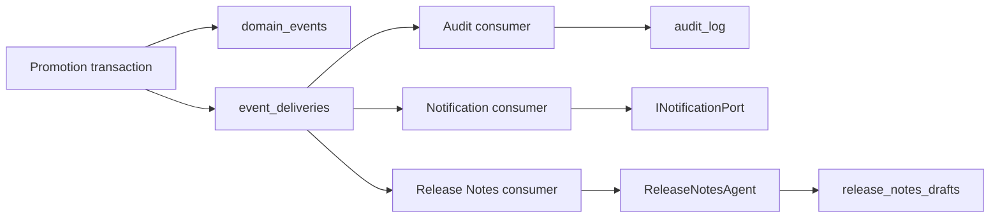
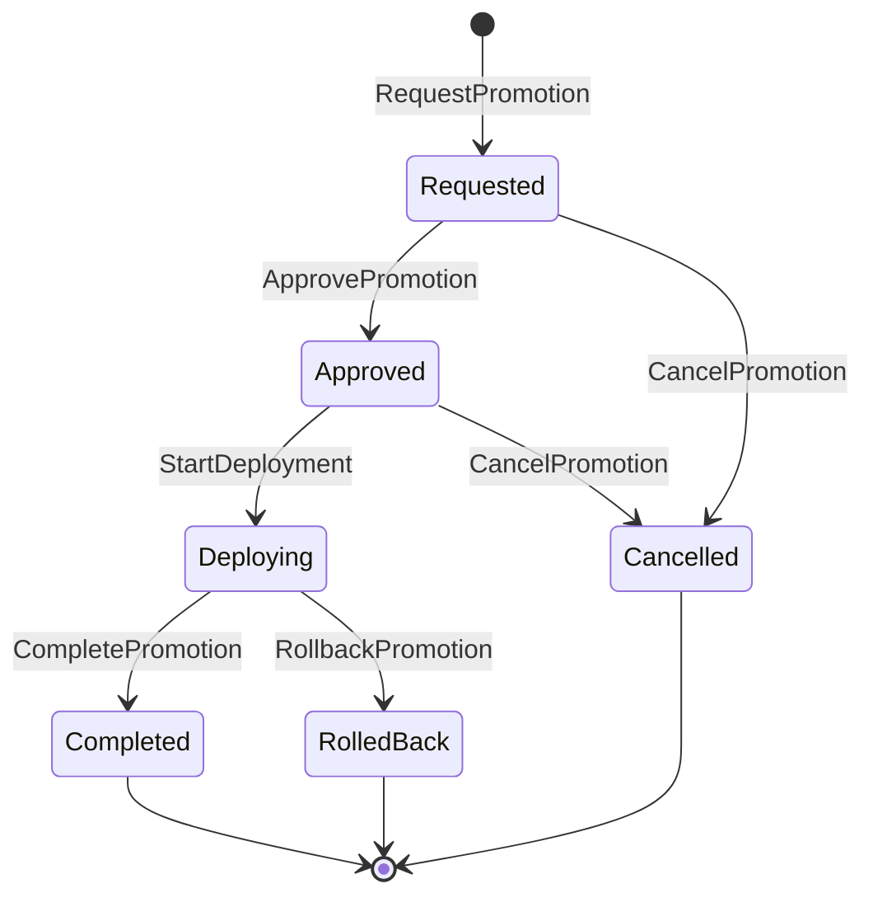

# ReleasePilot project walkthrough

This document walks through the ReleasePilot challenge.
It explains how I approached the challenge and some of the decisions made, although most of the decisions can be seen in the [Architecture Decision Records](adr/).

## Approach

My approach for the challenge has been to read and understand the challenge and think about how I want to approach its architecture; do extensive planning with AI; and then let agents implement the plans made through my decision-making and discussions with them. Once tasks were implemented, I reviewed the code, sent it to other agents for code reviews, and applied both my feedback and theirs.

## Procedure

I started with a few read-throughs of the challenge and quick chats with agents to get a full grasp of it and make sure I understood everything.

Once I had a clearer picture of the challenge, I thought about some key decisions like:

- directory and file structure and boundaries
- what messaging queue service to use
- testing strategy
- trade-offs
- limitations
- future improvements if this were a project that would continue evolving
- git structure
- split the work into vertical slices

With some of this already mostly decided and some of it left to be decided, I started a grilling session with an agent to clearly define the starting point and the context for the project. Once the first plan was agreed, an agent wrote a spec from it and the work was broken down into individual issues. For each issue, a first idea of the branch name and commits was written down.

At this point, implementation started for each issue, which was basically a loop of:

1. An agent run to implement the changes
2. Human review of the code and decisions, flagging anything that stands out or is misaligned
3. A second agent run to review the code and challenge the decisions made
4. An agent run to implement changes again
5. Repeat steps 2-4 until happy with the current result
6. Create a branch, commit the changes and open a PR
7. Let a remote agent review the code in the PR
8. Human does a final review
9. Any feedback is addressed by the human or an agent
10. Start again

## Key decisions

### PostgreSQL as a message queue instead of a dedicated broker

When reading "Publish every domain event to a queue and consume it in a decoupled handler that could be its own process", my first thought was "RabbitMQ" or maybe "Kafka". But after reading the challenge more closely, I considered that this is an internal platform that probably won't need to handle a huge volume of requests. Adding an extra infrastructure service just to act as an outbox felt a bit overkill for this application. Building a message queue in PostgreSQL solves the same problem while reducing service complexity and cost, without sacrificing much in terms of performance or features. Keeping events and delivery rows in the same transaction gives strong publication reliability and a one-command local environment. The cost is polling, database queue load, and fewer routing and operational features than a dedicated broker. At this scale, the operational simplicity is worth that cost.

So PostgreSQL is both the transactional database and the durable queue. Workers claim with `FOR UPDATE SKIP LOCKED`, increment the attempt before handling, and attach a 60-second lease plus a unique claim token. Completion or failure acknowledgement has to present the current token, so a stale worker cannot acknowledge a delivery that was reclaimed after its lease expired. The worker runs separately from the API and host three independent consumers in it:

- Audit listens to every Domain Event.
- Notification listens to Completed, Cancelled, and RolledBack.
- Release Notes listens to Approved.

Failures retry after 5, 10, 20, and 30 seconds. A fifth failed attempt becomes terminal. That is bounded at-least-once delivery, so the consumer effects are idempotent:

- Audit Log rows are unique by Event ID.
- The notification port gets the Event ID as its idempotency key.
- Release Notes Drafts are unique by Promotion and triggering Event.

### Domain model

I modeled `Promotion` as the aggregate and state machine:

Each successful transition changes the aggregate and records exactly one typed Domain Event:

| Command | Event |
| --- | --- |
| `RequestPromotion` | `PromotionRequested` |
| `ApprovePromotion` | `PromotionApproved` |
| `StartDeployment` | `DeploymentStarted` |
| `CompletePromotion` | `PromotionCompleted` |
| `RollbackPromotion` | `PromotionRolledBack` |
| `CancelPromotion` | `PromotionCancelled` |

I deliberately left no public status setter on the aggregate. Once a Promotion is Completed, Cancelled, or RolledBack, every later transition is rejected.

#### Invariant placement

I wanted the aggregate to own the business decisions:

- The first Promotion for a version targets dev.
- A later Promotion targets exactly the Environment after the last completed Environment.
- A completed Environment cannot be targeted again.
- Production completion ends progression.
- Only an approver may approve.
- Cancellation is valid only before Deployment starts.
- Rollback and completion are valid only while Deploying.
- Terminal Promotions are immutable.
- A competing active Promotion for the same Application and target Environment is rejected.

Some of those checks need persisted context (pipeline position and whether the target is already occupied). My approach was to let the request handler load those facts and pass them into `Promotion.Request`, while the aggregate still decides whether the request is valid and raises a specific Domain error. A PostgreSQL partial unique index on active `(application_id, target_environment)` closes the race between concurrent requests.

That split felt right to me: the Application layer gathers facts, the Domain decides, and the database protects the concurrent invariant.

### Transactional Domain Events

When a Promotion changes, I persist the new aggregate snapshot, the immutable typed Domain Event, and one delivery row for every subscribed consumer in a single PostgreSQL transaction. The API can respond as soon as that transaction commits, so there is no window where a business transition is durable but its asynchronous work is lost.

I intentionally did not go for event sourcing. The `promotions` table is the write model I load for the current aggregate state, and `domain_events` is the immutable history that feeds consumers. That keeps command handling simple (no replaying an event stream on every command) while still keeping a complete transition record.

### External-system ports

I used ports for anything the use cases and Domain need from the outside world, without pulling HTTP clients or vendor SDKs into the core:

- `IDeploymentPort` starts a Deployment.
- `IIssueTrackerPort` retrieves linked Work Items and asks for clarification.
- `INotificationPort` reports terminal outcomes.
- `ILanguageModel` asks a model for structured tool calls.

Domain-facing capabilities sit with the Domain, orchestration-specific ones sit in Application, and adapters live in Infrastructure. I skipped a generic repository abstraction on purpose; each interface describes the queries and consistency needs of its owner.

The adapters I submitted are deliberately deterministic and in memory. That made failure and idempotency behavior easy to test without pretending a real external service exists.

### Release Notes agent

When a Promotion is approved, I enqueue a Release Notes delivery. Instead of one prompt and one answer, the consumer runs a bounded, iterative tool-calling loop:

1. `GetWorkItems(promotionId)` loads fixed linked work items.
2. `AskClarification(workItemId, question)` resolves an ambiguity.
3. `FlagBreakingChange(workItemId, reason)` records structured run-local state.
4. `SubmitReleaseNotes(draft)` persists the Markdown draft and Breaking Changes.

The deterministic model I shipped happens to choose that sequence, but the loop itself is model-agnostic. It appends each tool call and result to the conversation before asking for the next action, and it validates tool names, arguments, linked Work Item membership, submission ordering, and non-empty drafts.

An unknown tool, invalid arguments, finishing without a submission, or going past ten model turns fails the delivery through the same retry path as every other consumer. Promotion details expose a nullable draft because generation is asynchronous — I did not want the approve API to wait on the agent.

If I were to ship a real agent, I would probably use some existing Agent frameworks like [Eve](https://vercel.com/eve), [Mastra](https://mastra.ai), etc., probably in Typescript for the huge ecosystem around agent frameworks and tools that exist nowadays.

### Snapshots plus immutable events

I kept snapshots for command loads and read models, and immutable events for history and consumers. The trade-off is maintaining two related representations instead of treating the event stream as the only source of truth. For this challenge, that simplicity was worth it.

### Contextual Domain invariants

Passing the last completed Environment and the active-target fact into the aggregate let me keep the decision in Domain code without giving the aggregate database access. The trade-off is that concurrency still needs a database constraint and exception translation.

### Synchronous Deployment invocation

I call the Deployment port before commit so ReleasePilot does not record Deploying when the adapter clearly failed. A stable idempotency key makes an uncertain timeout retryable. The cost is some API latency, and there is still a distributed-systems ambiguity between external success and local commit failure. I preferred that over writing Deploying blindly.

### One worker process

Each consumer is modeled independently, but I host them in one executable. That keeps the demo easy to run while leaving a clear seam if I ever need to extract them. The trade-off is shared scaling and failure boundaries — fine at this scale.

The fuller decision history is in the [Architecture Decision Records](adr/).

## Testing strategy

For Domain tests, I focused on the Promotion state machine: authorization, progression, conflicts, terminal immutability, retry eligibility, and the events each transition emits.

Integration tests spin up isolated PostgreSQL 18 containers and cover public HTTP behavior, persistence, queries, queue leases and retries, consumer idempotency, and the agent loop. For time-sensitive queue tests I inject a `TimeProvider` instead of sleeping to keep those tests fast and deterministic.

The full manual journey lives in the README. I planned a single automated end-to-end journey that starts the Compose API and worker together as issue 12, but I did not implement it at the end although it was planned.

## Known limitations

These are the main gaps I am aware of:

- Authentication is a seeded `X-User-Id` header; there is no identity provider or token validation.
- Applications, versions, Environments, users, and Work Items have no management API.
- The Environment pipeline is fixed and cannot be configured.
- External Deployment, issue tracker, notification, and language model adapters are in memory.
- There are no database migrations; initialization uses SQL scripts on a fresh volume.
- There is no queue administration, replay API, retention policy, or dead-letter recovery workflow.
- Agent transcripts and run metadata are not persisted.
- There is no frontend, production observability platform, or CI workflow.
- Consumers share one worker process.
- The full Compose-based release journey is manual rather than an automated end-to-end test.

## Future improvements

If I kept working on this, I would prioritize getting a real MVP running first, then harden around it:

1. Replace in-memory adapters one at a time with resilient clients using timeouts, retries, circuit breaking, credentials, and contract tests — without this, Deployment, notifications, issue tracking, and the language model are stubs and nothing useful happens end to end.
2. Add real authentication and policy-based authorization while preserving Domain role checks.
3. Add versioned database migrations so the schema can evolve beyond a fresh-volume SQL bootstrap.
4. Add the missing full-stack acceptance journey to CI so the MVP stays protected as adapters and auth land.
5. Add structured traces and metrics for command latency, queue age, attempts, terminal failures, and agent turns.
6. Add operational queue tooling for failed-delivery inspection and replay, plus a backup policy.
7. Persist agent-run metadata and a redacted tool transcript for support and governance.
8. Extract or independently scale consumers only when workload or isolation requirements justify it.

Overall I favored a small, defensible vertical slice over trying to cover every surface. The root README has the exact commands to start, exercise, inspect, and reset that slice.
